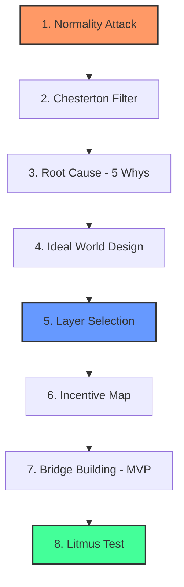

  

# Revolutionary Layers Method (Ecosystem Inversion)

**Author:** Jaloliddin ([xalimov.vercel.app](https://xalimov.vercel.app))

> © 2026 Jaloliddin. All rights reserved. This methodology was developed by the author and is distributed under the MIT License (see below).

A strategic framework for building robust startups by attacking "normality" and inverting system dependencies — instead of patching symptoms, redesign the system so the obstacle no longer exists.

---

## 🚀 Overview

Most startup failures trace back to solving the wrong problem, or solving a real problem at the wrong layer of the system. The **Revolutionary Layers Method** shifts the focus from fixing symptoms to re-architecting systems, borrowing the logic of **Dependency Inversion** (from software architecture) and **Inverse Planning** (from AI) as metaphors for business strategy.

## 🧠 Conceptual Foundations

- **Dependency Inversion (metaphor):** In software, high-level logic shouldn't depend on low-level details — both should depend on a shared abstraction. Applied to startups: instead of building a product that depends on today's market conditions, build the layer that other players end up depending on.
- **Inverse Planning (metaphor):** In AI, inverse planning infers an agent's goals by observing its actions. Applied here: instead of asking customers what they want, infer the goal behind their workaround — the habit itself is evidence of an unmet need.
- **Proactive Risk Mitigation:** Building compliance, security, and incentive-alignment into the foundation rather than retrofitting them tends to be cheaper than fixing problems after they surface — this is a general risk-management principle, not a measured figure specific to this framework.

*Note on terminology: these are deliberate metaphors borrowed from other fields to sharpen strategic thinking, not literal technical implementations of Dependency Inversion or Inverse Planning as defined in software engineering or AI research.*

## 🙏 Influences

This framework is a synthesis, not a from-scratch invention. It draws on and recombines:
- **Chesterton's Fence** (G.K. Chesterton) — don't remove a rule until you understand why it's there.
- **Five Whys** (Toyota Production System) — root-cause analysis technique.
- **Wardley Mapping** (Simon Wardley) — mapping components by evolution and value chain position, echoed in the Layer Selection step.
- **Stakeholder / incentive analysis** — standard practice in political economy and organizational strategy.
- **Contrarian/secret-seeking questions** (popularized by Peter Thiel and others) — the spirit behind the Normality Attack step.

The contribution of this framework is combining these into one ordered 8-step sequence aimed specifically at startup strategy — not any single step in isolation.

## 🛠 The 8-Step Framework

1. **Normality Attack:** Identify a common habit everyone accepts as "normal" but is fundamentally absurd.
2. **Chesterton Filter:** Determine if the absurdity serves a hidden function (trust, signal, coordination). If so, reinvent it efficiently rather than discarding it outright.
3. **Root Cause Analysis:** Use the "Five Whys" to dig into the deepest systemic obstacle (legal, technological, or social).
4. **Ideal World Design:** Design the system as if the primary obstacle never existed.
5. **Layer Selection:** Define your position in the ecosystem: Vision → Infrastructure → Platform → Ecosystem.
6. **Incentive Map:** Map who wins and who loses from this systemic change (political and economic risk).
7. **Bridge Building:** Design the transition path from today to the ideal world via an MVP.
8. **Litmus Test:** "10 years from now, which 'problem' will have become completely invisible thanks to my success?"

## 📊 Diagram

## 📝 Worked Example: A Startup Case Study

**The startup, before applying the method:** "TalentBoard" — a job-matching platform for IT talent. The pitch: yet another marketplace where companies post jobs and candidates upload a CV/resume to apply. Feature-wise it's competitive — filters, messaging, a slick UI — but structurally it's a thin layer sitting on top of the same CV-based hiring habit everyone already uses.

**Why it's likely to fail as-is:**
- No structural moat — LinkedIn, HH.uz, and dozens of local boards already do this; TalentBoard competes on marketing spend and UI polish, not on defensibility.
- It never questions why CVs are used at all — it just makes uploading and filtering them slightly faster.
- Growth depends on winning both sides of a two-sided market (candidates AND employers) simultaneously against entrenched incumbents — a classic cold-start problem with no unique wedge.

**Running it through the 8 steps:**

1. **Normality Attack:** Everyone treats the CV as the "normal" way to prove employability — but a self-written document is a genuinely weak, easily gamed signal of actual skill.
2. **Chesterton Filter:** The hidden function of the CV is *risk reduction for the hiring manager* — a cheap way to filter thousands of applicants. That function is needed; the specific mechanism (self-reported history) is what's replaceable.
3. **Root Cause Analysis:** Why CVs? → Because real skill verification (tests, live work samples) used to be slow and expensive at scale → Why expensive? → No shared infrastructure for standardized, verifiable skill assessment existed → Why none? → No single platform had enough volume across employers to make building one worthwhile.
4. **Ideal World Design:** Hiring managers see a verified skill profile — based on completed tasks, peer/expert review, and real outcomes — instead of a self-written narrative.
5. **Layer Selection:** Don't build "another job board" (Application layer). Build the **verification layer** — a skill-certification and portfolio-verification protocol that job boards, recruiters, and even LinkedIn could plug into.
6. **Incentive Map:** Candidates without prestigious degrees or big-brand résumés win (skill becomes visible); good recruiters win (faster, more reliable signal); traditional CV-screening agencies and keyword-matching ATS vendors lose relevance; incumbent boards may resist integrating a layer that reduces their own data lock-in.
7. **Bridge Building:** MVP isn't a full marketplace — it's a verification badge and skill-assessment API piloted with 3–5 companies' existing hiring pipelines, proving the signal is more predictive than a CV before building anything else.
8. **Litmus Test:** In 10 years, "attach your CV" stops being the first question in any hiring flow.

**What changes after the method:** TalentBoard-as-a-job-board has a narrow, saturated market and no defensible position — the most likely outcome is a slow bleed against better-funded competitors. TalentBoard-as-a-verification-layer has a genuinely different value proposition: it doesn't compete with job boards, it becomes infrastructure *underneath* them. That's a smaller, harder first step to build, but a structurally more promising one — the kind of position a well-funded competitor can't simply out-market.

That's the point of the method: it doesn't guarantee success, but it moves the bet from "can we out-execute in a crowded market" to "did we correctly identify a lower, more defensible layer to build on."

## ⚠️ Limitations

- **Not every "absurd normal" is safe to attack.** Some conventions exist for legal, regulatory, or safety reasons that aren't obvious from the outside — skipping the Chesterton Filter step is the most common way this framework gets misused.
- **Layer Selection requires real market power or timing.** Choosing "Infrastructure" or "Ecosystem" as your layer doesn't make it achievable — most startups don't have the distribution or capital to occupy those layers, and forcing it can be worse than building a good product at the application layer.
- **This is a strategic lens, not a validated methodology.** It hasn't been tested across a portfolio of companies with measured outcomes; treat it as a structured way to think, not a guarantee of results.
- **Best suited for founders already past the "what problem am I solving" stage** — it assumes a real, validated pain point exists and helps you decide *where* and *how deep* to intervene.

## 📄 License

This framework is released under the [MIT License](./LICENSE).

---

🌐 Other languages: [O'zbekcha](./README_UZ.md) | [Русский](./README_RU.md)