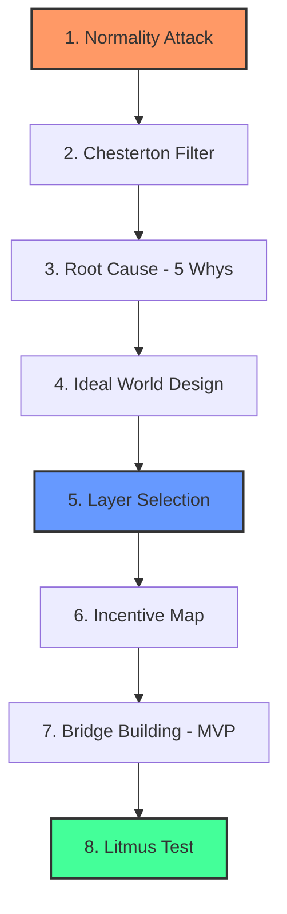

# Метод Революционных Слоев (Инверсия Экосистемы)

**Автор:** Джалолиддин ([xalimov.vercel.app](https://xalimov.vercel.app))

> © 2026 Джалолиддин. Все права защищены. Данная методология разработана автором и распространяется по лицензии MIT (см. ниже).

Стратегический фреймворк для создания устойчивых стартапов через атаку на «нормальность» и инверсию системных зависимостей — вместо лечения симптомов, перепроектируйте систему так, чтобы препятствие исчезло вовсе.

---

## 🚀 Введение

Большинство провалов стартапов сводятся к решению неправильной проблемы — либо к решению правильной проблемы на неверном уровне системы. **Метод Революционных Слоев** переносит фокус с исправления симптомов на перепроектирование системы, используя логику **Dependency Inversion** (из архитектуры ПО) и **Inverse Planning** (из ИИ) как метафоры для бизнес-стратегии.

## 🧠 Концептуальные Основы

- **Dependency Inversion (метафора):** В разработке ПО высокоуровневая логика не должна зависеть от низкоуровневых деталей — обе стороны зависят от общей абстракции. Применительно к стартапам: вместо продукта, зависящего от текущих рыночных условий, стройте слой, от которого будут зависеть другие.
- **Inverse Planning (метафора):** В ИИ это процесс определения целей агента через наблюдение за его действиями. Здесь: вместо того чтобы спрашивать клиента, чего он хочет, выявляйте реальную потребность, стоящую за его «обходным путём».
- **Проактивное управление рисками:** Встраивание комплаенса, безопасности и согласования стимулов в фундамент проекта, как правило, дешевле, чем исправление проблем постфактум — это общий принцип риск-менеджмента, а не измеренный показатель, специфичный для данного фреймворка.

*Примечание о терминологии: перечисленное выше — намеренные метафоры из других областей для усиления стратегического мышления, а не буквальная техническая реализация Dependency Inversion или Inverse Planning в их инженерном/исследовательском смысле.*

## 🙏 Источники Влияния

Этот фреймворк — синтез, а не изобретение с нуля. Он опирается на:
- **Забор Честертона** (Chesterton's Fence, Г.К. Честертон) — не убирайте правило, не поняв, зачем оно появилось.
- **5 Почему** (производственная система Toyota) — техника анализа первопричин.
- **Wardley Mapping** (Саймон Уордли) — картирование компонентов по эволюции и позиции в цепочке ценности, отражено в шаге Layer Selection.
- **Анализ стейкхолдеров и стимулов** — стандартная практика в политической экономии и организационной стратегии.
- **Контрариантские вопросы** (популяризированы, в частности, Питером Тилем) — дух шага Normality Attack.

Ценность этого фреймворка — в объединении этих элементов в один упорядоченный процесс из 8 шагов, направленный именно на стартап-стратегию, а не в каком-то одном шаге по отдельности.

## 🛠 8 Шагов Фреймворка

1. **Атака на Нормальность (Normality Attack):** Найдите привычку, которую все считают нормальной, но которая на самом деле абсурдна (например: пароли, резюме).
2. **Фильтр Честертона:** Поймите скрытую функцию этого абсурда (доверие, сигнал). Если функция нужна — переизобретите её в более дешевом виде, а не отбрасывайте вовсе.
3. **Анализ Первопричин (Root Cause Analysis):** Используйте технику «5 почему», чтобы найти глубокое системное препятствие.
4. **Проектирование Идеального Мира:** Опишите, как работала бы система, если бы этого препятствия не существовало.
5. **Выбор Слоя:** Определите свою роль: Видение → Инфраструктура → Платформа → Экосистема.
6. **Карта Стимулов (Incentive Map):** Кто выигрывает, а кто теряет от системных изменений?
7. **Построение Моста:** Разработайте путь перехода к идеальному миру через MVP.
8. **Лакмусовая Бумажка:** «Через 10 лет, какую вещь люди перестанут воспринимать как "проблему" благодаря моему успеху?»

## 📊 Диаграмма

## 📝 Практический Пример: Кейс Стартапа

**Стартап без метода:** «TalentBoard» — платформа поиска работы для IT-специалистов. Идея: компании публикуют вакансии, кандидаты загружают резюме и откликаются — ещё один маркетплейс. По функциям конкурентоспособен — фильтры, чат, аккуратный интерфейс — но структурно это тонкий слой над той же привычкой найма по резюме, которую использует и весь рынок.

**Почему он рискует провалиться в текущем виде:**
- Нет структурной защиты — LinkedIn, HH.uz и десятки локальных площадок уже делают это; TalentBoard конкурирует маркетинговым бюджетом и интерфейсом, а не защищённой позицией.
- Он никогда не задаёт вопрос, почему резюме используется вообще — он просто немного ускоряет загрузку и фильтрацию.
- Рост зависит от одновременной победы на обеих сторонах двустороннего рынка (кандидаты И работодатели) против устоявшихся игроков — классическая проблема холодного старта без уникального клина входа.

**Прохождение через 8 шагов:**

1. **Атака на Нормальность:** Все считают резюме «нормальным» способом доказать пригодность к работе — но самостоятельно написанный документ — слабый и легко подделываемый сигнал реального навыка.
2. **Фильтр Честертона:** Скрытая функция резюме — *снижение риска для работодателя*, дешёвый способ отфильтровать тысячи кандидатов. Эта функция нужна; сам механизм (самоописанная история) — заменим.
3. **Анализ Первопричин:** Почему резюме? → Потому что реальная проверка навыков (тесты, образцы работы) в масштабе была медленной и дорогой → Почему дорогой? → Не существовало общей инфраструктуры для стандартизированной, проверяемой оценки навыков → Почему не существовало? → Ни у одной платформы не было достаточного объёма среди работодателей, чтобы её строить.
4. **Проектирование Идеального Мира:** Работодатель видит проверенный профиль навыков — на основе выполненных задач, экспертной оценки и реальных результатов — вместо самостоятельно написанного нарратива.
5. **Выбор Слоя:** Не стройте «ещё одну доску объявлений» (уровень приложения). Стройте **слой верификации** — протокол сертификации и проверки навыков, к которому могут подключаться другие площадки, рекрутеры и даже LinkedIn.
6. **Карта Стимулов:** Кандидаты без престижных дипломов или громких имён в резюме выигрывают (навык становится видимым); хорошие рекрутеры выигрывают (быстрый, надёжный сигнал); традиционные агентства по скринингу резюме и ATS с поиском по ключевым словам теряют значимость; действующие площадки могут сопротивляться интеграции слоя, снижающего их собственную монополию на данные.
7. **Построение Моста:** MVP — не полноценный маркетплейс, а значок верификации и API оценки навыков, пилотируемый в существующих процессах найма 3–5 компаний, доказывающий, что сигнал точнее резюме — прежде чем строить что-либо ещё.
8. **Лакмусовая Бумажка:** Через 10 лет «прикрепите резюме» перестаёт быть первым вопросом в любом процессе найма.

**Что меняется после применения метода:** TalentBoard-как-доска-объявлений имеет узкий, перенасыщенный рынок и незащищённую позицию — наиболее вероятный исход — медленное угасание перед более финансируемыми конкурентами. TalentBoard-как-слой-верификации имеет принципиально иное ценностное предложение: он не конкурирует с площадками по поиску работы, а становится инфраструктурой *под* ними. Это меньший и более сложный первый шаг, но структурно куда более перспективный — позиция, которую конкуренту с большим бюджетом не так просто просто «перемаркетить».

В этом и смысл метода: он не гарантирует успех, но переносит ставку с «сможем ли мы исполнить лучше на перенасыщенном рынке» на «правильно ли мы определили более низкий, более защищённый слой для построения».

## ⚠️ Ограничения

- **Не каждую «абсурдную норму» безопасно атаковать.** Некоторые конвенции существуют по юридическим, нормативным или связанным с безопасностью причинам, не очевидным со стороны — пропуск шага Фильтра Честертона — самая частая ошибка при использовании этого фреймворка.
- **Выбор Слоя требует реальной рыночной силы или подходящего момента.** Выбор уровня «Инфраструктура» или «Экосистема» не гарантирует его достижимости — у большинства стартапов нет ресурсов или дистрибуции для этих слоёв, и попытка занять их силой может быть хуже, чем хороший продукт на уровне приложения.
- **Это стратегическая линза, а не проверенная методология.** Она не тестировалась на портфеле компаний с измеримыми результатами; используйте её как структуру для мышления, а не как гарантию результата.
- **Лучше всего подходит основателям, уже прошедшим этап «какую проблему я решаю».** Фреймворк предполагает наличие реальной, подтверждённой болевой точки и помогает решить, *где* и *насколько глубоко* вмешаться.

## 📄 Лицензия

Этот фреймворк распространяется по лицензии [MIT](./LICENSE).

---

🌐 Другие языки: [O'zbekcha](./README_UZ.md) | [English](./README.md)
