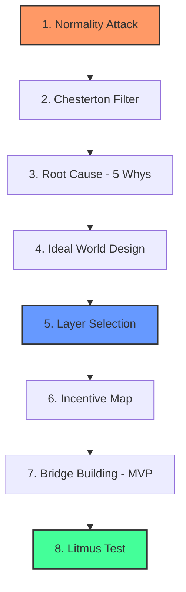

# Inqilobiy Qatlamlar Metodi (Revolutionary Layers Method)

**Muallif:** Jaloliddin ([xalimov.vercel.app](https://xalimov.vercel.app))

> © 2026 Jaloliddin. Barcha huquqlar himoyalangan. Ushbu metodologiya muallif tomonidan ishlab chiqilgan va MIT litsenziyasi asosida tarqatiladi (pastga qarang).

---

## 🚀 Kirish

Ko'p startaplar muvaffaqiyatsizlikka uchraydi, chunki ular noto'g'ri muammoni yechadi yoki to'g'ri muammoni tizimning noto'g'ri qatlamida yechishga urinadi. **Inqilobiy Qatlamlar Metodi** e'tiborni simptomlarni tuzatishdan tizimni qayta qurishga qaratadi — buning uchun dasturiy ta'minot arxitekturasidagi **Dependency Inversion** va sun'iy intellektdagi **Inverse Planning** g'oyalaridan metafora sifatida foydalanadi.

## 🧠 Kontseptual Asoslar

- **Dependency Inversion (metafora):** Dasturchilikda yuqori darajadagi mantiq past darajadagi detallarga bog'liq bo'lmasligi kerak — ikkisi ham umumiy abstraksiyaga tayanadi. Startapga tatbiqan: bugungi bozor sharoitiga bog'liq mahsulot qurish o'rniga, boshqalar tayanadigan qatlamni qurish.
- **Inverse Planning (metafora):** AI'da bu — agentning harakatlaridan uning maqsadini chiqarib olish jarayoni. Bizda: mijozdan nima xohlaysiz deb so'rash o'rniga, uning "chiqish yo'li" (workaround) ortidagi haqiqiy ehtiyojni aniqlash.
- **Proaktiv Xavf Boshqaruvi:** Komplaens, xavfsizlik va rag'batlarni loyihaning boshidan fundamentga qurish, odatda, muammo chiqib ketgandan keyin tuzatishdan arzonroq tushadi — bu umumiy risk-menejment printsipi, ushbu metod uchun o'lchangan aniq raqam emas.

*Terminologiya haqida eslatma: yuqoridagilar boshqa sohalardan olingan strategik metaforalar, dasturiy ta'minot yoki AI'dagi texnik ta'rifning to'g'ridan-to'g'ri tatbiqi emas.*

## 🙏 Ta'sir Manbalari

Ushbu freymvork noldan ixtiro emas, balki sintez. U quyidagilarga tayanadi:
- **Chesterton's Fence** (G.K. Chesterton) — qoidani nima uchun bor ekanligini tushunmasdan olib tashlamang.
- **Five Whys** (Toyota ishlab chiqarish tizimi) — ildiz sabab tahlili texnikasi.
- **Wardley Mapping** (Simon Wardley) — komponentlarni evolyutsiya va qiymat zanjiridagi o'rniga qarab xaritalash, Layer Selection bosqichida aks etadi.
- **Stakeholder / rag'bat tahlili** — siyosiy iqtisod va tashkiliy strategiyada standart amaliyot.
- **Contrarian savollar** (Peter Thiel va boshqalar tomonidan mashhur qilingan) — Normality Attack bosqichining ruhi.

Ushbu freymvorkning qiymati — bu elementlarni bitta tartiblangan 8 bosqichli ketma-ketlikka, aynan startap strategiyasi uchun birlashtirganida, alohida bosqichlarning o'zida emas.

## 🛠 Frameworkning 8 Bosqichi

1. **Normality Attack (Normallikka Hujum):** Muammoni emas, hamma "normal" deb qabul qilgan, lekin aslida absurd bo'lgan odatni toping (masalan: CV, parollar, an'anaviy ta'lim).
2. **Chesterton Filtri:** Ushbu absurdlikning yashirin funksiyasini (ishonch, signal, koordinatsiya) aniqlang. Agar funksiya kerak bo'lsa, uni butunlay olib tashlamasdan, yangi va arzonroq shaklda qayta ixtiro qiling.
3. **Ildiz Sabab Tahlili (Root Cause Analysis):** "Besh nima uchun" (Five Whys) texnikasi orqali tizimli to'siqni eng chuqur darajada aniqlang.
4. **Ideal Dunyo Tasviri:** "Agar bu to'siq umuman bo'lmasa, tizim qanday ishlardi?" — batafsil loyihalashtiring.
5. **Qatlamni Tanlash:** Ekotizimning qaysi qatlamida turasiz: Vision → Infrastructure → Platform → Ecosystem?
6. **Incentive (Rag'bat) Xaritasi:** Kim foyda ko'radi va kim zarar ko'radi (siyosiy va iqtisodiy xavf)?
7. **Ko'prik Qurish:** Bugungi holatdan ideal dunyoga o'tish uchun Minimal Hayotiy Mahsulot (MVP) yoki infratuzilmaviy yo'lni loyihalashtiring.
8. **Lakmus Testi:** "Agar men muvaffaqiyatga erishsam, 10 yildan keyin odamlar qaysi narsani endi 'muammo' deb hisoblamay qo'yadi?"

## 📊 Vizual Sxema

## 📝 Amaliy Misol: Parollar

1. **Normality Attack:** Hamma parol kiritishni "normal" deb qabul qiladi, lekin bu haqiqatan ham absurd tajriba — unutiladigan, qayta ishlatiladigan va fishing qilinadigan maxfiy satr.
2. **Chesterton Filtri:** Yashirin funksiya — *shaxsni tasdiqlash*. Bu funksiya hali ham kerak — mexanizmning o'zi (yodda saqlanadigan satr) esa keraksiz.
3. **Ildiz Sabab Tahlili:** Nega parollar? → Chunki dastlabki tizimlarga arzon, universal identifikatsiya kerak edi → Nega arzon? → Chunki apparat asosidagi autentifikatsiya (kalitlar, biometriya) qimmat va standart emas edi → Nega standart emas? → Umumiy protokol qatlami yo'q edi.
4. **Ideal Dunyo Tasviri:** Shaxs siz *kimligingiz* yoki *egaligingiz* (qurilma, biometriya, kalit) orqali, umumiy standart bilan tasdiqlanadi, yodda saqlanadigan yoki chiqib ketishi mumkin bo'lgan maxfiylik yo'q.
5. **Qatlamni Tanlash:** Bu **Infratuzilma** qatlamida joylashadi — boshqa mahsulotlar tayanadigan protokol (bu WebAuthn/passkey g'oyasi).
6. **Incentive Xaritasi:** Parol menejerlari va eski IT ahamiyatini yo'qotadi; foydalanuvchilar va xavfsizlik jamoalari yutadi; platforma egalari (Apple, Google) yangi ishonch qatlami sifatida kuch oladi.
7. **Ko'prik Qurish:** MVP = parolsiz kirishni eski parol bilan bir qatorda *tanlov* sifatida taklif qilish, eski oqimni bekor qilishdan oldin ishonchliligini isbotlash.
8. **Lakmus Testi:** 10 yildan keyin "parolimni unutdim" ko'pchilik foydalanuvchi hech qachon uchramaydigan muammoga aylanadi.

## ⚠️ Cheklovlar

- **Har qanday "absurd normani" hujumga olish xavfsiz emas.** Ba'zi odatlar tashqaridan ko'rinmaydigan huquqiy, me'yoriy yoki xavfsizlik sabablari uchun mavjud — Chesterton Filtri bosqichini o'tkazib yuborish bu metodning eng ko'p uchraydigan noto'g'ri qo'llanilish shakli.
- **Qatlamni Tanlash uchun haqiqiy bozor kuchi yoki vaqt kerak.** "Infrastructure" yoki "Ecosystem" qatlamini tanlash uni erishish mumkin degani emas — aksariyat startaplarda bu qatlamlarni egallash uchun tarqatish yoki kapital yetarli emas, va buni majburlab qilish oddiy mahsulot qatlamida yaxshi ishlashdan yomonroq bo'lishi mumkin.
- **Bu tasdiqlangan metodologiya emas, strategik linza.** U hali ko'plab kompaniyalarda o'lchangan natijalar bilan sinovdan o'tmagan; buni fikrlash uchun tuzilma deb qabul qiling, natija kafolati deb emas.
- **"Qaysi muammoni yechyapman" bosqichidan o'tgan asoschilar uchun eng foydali** — bu metod haqiqiy, tasdiqlangan og'riq nuqtasi mavjudligini taxmin qiladi va sizga *qayerda* va *qanchalik chuqur* aralashishni tanlashda yordam beradi.

## 📄 Litsenziya

Ushbu framework MIT litsenziyasi asosida tarqatiladi. Batafsil: [LICENSE](./LICENSE) faylini ko'ring.

---

🌐 Boshqa tillar: [English](./README.md) | [Русский](./README_RU.md)
