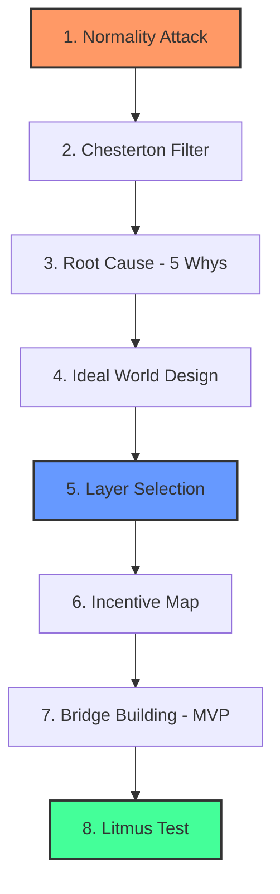

# Inqilobiy Qatlamlar Metodi (Revolutionary Layers Method)

**Muallif:** Jaloliddin ([xalimov.vercel.app](https://xalimov.vercel.app))

> © 2026 Jaloliddin. Barcha huquqlar himoyalangan. Ushbu metodologiya muallif tomonidan ishlab chiqilgan va MIT litsenziyasi asosida tarqatiladi (pastga qarang).

---

## 🚀 Kirish

Ko'p startaplar muvaffaqiyatsizlikka uchraydi, chunki ular noto'g'ri muammoni yechadi yoki to'g'ri muammoni tizimning noto'g'ri qatlamida yechishga urinadi. **Inqilobiy Qatlamlar Metodi** e'tiborni simptomlarni tuzatishdan tizimni qayta qurishga qaratadi — buning uchun dasturiy ta'minot arxitekturasidagi **Dependency Inversion** va sun'iy intellektdagi **Inverse Planning** g'oyalaridan metafora sifatida foydalanadi.

## 🧠 Kontseptual Asoslar

- **Dependency Inversion (metafora):** Dasturchilikda yuqori darajadagi mantiq past darajadagi detallarga bog'liq bo'lmasligi kerak — ikkisi ham umumiy abstraksiyaga tayanadi. Startapga tatbiqan: bugungi bozor sharoitiga bog'liq mahsulot qurish o'rniga, boshqalar tayanadigan qatlamni qurish.
- **Inverse Planning (metafora):** AI'da bu — agentning harakatlaridan uning maqsadini chiqarib olish jarayoni. Bizda: mijozdan nima xohlaysiz deb so'rash o'rniga, uning "chiqish yo'li" (workaround) ortidagi haqiqiy ehtiyojni aniqlash.
- **Proaktiv Xavf Boshqaruvi:** Komplaens, xavfsizlik va rag'batlarni loyihaning boshidan fundamentga qurish, odatda, muammo chiqib ketgandan keyin tuzatishdan arzonroq tushadi — bu umumiy risk-menejment printsipi, ushbu metod uchun o'lchangan aniq raqam emas.

*Terminologiya haqida eslatma: yuqoridagilar boshqa sohalardan olingan strategik metaforalar, dasturiy ta'minot yoki AI'dagi texnik ta'rifning to'g'ridan-to'g'ri tatbiqi emas.*

## 🙏 Ta'sir Manbalari

Ushbu freymvork noldan ixtiro emas, balki sintez. U quyidagilarga tayanadi:
- **Chesterton's Fence** (G.K. Chesterton) — qoidani nima uchun bor ekanligini tushunmasdan olib tashlamang.
- **Five Whys** (Toyota ishlab chiqarish tizimi) — ildiz sabab tahlili texnikasi.
- **Wardley Mapping** (Simon Wardley) — komponentlarni evolyutsiya va qiymat zanjiridagi o'rniga qarab xaritalash, Layer Selection bosqichida aks etadi.
- **Stakeholder / rag'bat tahlili** — siyosiy iqtisod va tashkiliy strategiyada standart amaliyot.
- **Contrarian savollar** (Peter Thiel va boshqalar tomonidan mashhur qilingan) — Normality Attack bosqichining ruhi.

Ushbu freymvorkning qiymati — bu elementlarni bitta tartiblangan 8 bosqichli ketma-ketlikka, aynan startap strategiyasi uchun birlashtirganida, alohida bosqichlarning o'zida emas.

## 🛠 Frameworkning 8 Bosqichi

1. **Normality Attack (Normallikka Hujum):** Muammoni emas, hamma "normal" deb qabul qilgan, lekin aslida absurd bo'lgan odatni toping (masalan: CV, parollar, an'anaviy ta'lim).
2. **Chesterton Filtri:** Ushbu absurdlikning yashirin funksiyasini (ishonch, signal, koordinatsiya) aniqlang. Agar funksiya kerak bo'lsa, uni butunlay olib tashlamasdan, yangi va arzonroq shaklda qayta ixtiro qiling.
3. **Ildiz Sabab Tahlili (Root Cause Analysis):** "Besh nima uchun" (Five Whys) texnikasi orqali tizimli to'siqni eng chuqur darajada aniqlang.
4. **Ideal Dunyo Tasviri:** "Agar bu to'siq umuman bo'lmasa, tizim qanday ishlardi?" — batafsil loyihalashtiring.
5. **Qatlamni Tanlash:** Ekotizimning qaysi qatlamida turasiz: Vision → Infrastructure → Platform → Ecosystem?
6. **Incentive (Rag'bat) Xaritasi:** Kim foyda ko'radi va kim zarar ko'radi (siyosiy va iqtisodiy xavf)?
7. **Ko'prik Qurish:** Bugungi holatdan ideal dunyoga o'tish uchun Minimal Hayotiy Mahsulot (MVP) yoki infratuzilmaviy yo'lni loyihalashtiring.
8. **Lakmus Testi:** "Agar men muvaffaqiyatga erishsam, 10 yildan keyin odamlar qaysi narsani endi 'muammo' deb hisoblamay qo'yadi?"

## 📊 Vizual Sxema

## 📝 Amaliy Misol: Startap Case Study

**Metodsiz startap:** "TalentBoard" — IT mutaxassislar uchun ish qidirish platformasi. G'oya: kompaniyalar ish e'lonini joylaydi, nomzodlar CV/rezyume yuklab ariza beradi — yana bitta marketpleys. Funksional jihatdan raqobatbardosh — filtrlar, xabar almashish, chiroyli interfeys — lekin tuzilishi jihatidan bu hammaning ishlatayotgan CV-asosidagi yollash odatining ustiga qo'yilgan yupqa qatlam, xolos.

**Nega u hozirgi holida muvaffaqiyatsizlikka uchrashi mumkin:**
- Strukturaviy himoya yo'q — LinkedIn, HH.uz va o'nlab mahalliy platformalar buni allaqachon qilyapti; TalentBoard marketing xarajati va interfeys bilan raqobatlashadi, himoyalanuvchan ustunlik bilan emas.
- U CV nima uchun ishlatilayotganini hech qachon so'ramaydi — u shunchaki yuklash va filtrlashni bir oz tezlashtiradi.
- O'sish ikki tomonlama bozorning (nomzodlar VA ish beruvchilar) ikkisini bir vaqtda, mustahkam o'rnashib olgan raqobatchilarga qarshi yutishga bog'liq — noyob "wedge" (kirish nuqtasi)siz klassik cold-start muammosi.

**8 bosqichdan o'tkazish:**

1. **Normality Attack:** Hamma CV'ni bandlikka layoqatni isbotlashning "normal" yo'li deb hisoblaydi — lekin o'zi yozgan hujjat haqiqiy ko'nikmaning zaif va oson soxtalashtiriladigan signali, xolos.
2. **Chesterton Filtri:** CV'ning yashirin funksiyasi — *ish beruvchi uchun xavfni kamaytirish* — minglab arizachini arzon filtrlash yo'li. Bu funksiya kerak; mexanizmning o'zi (o'z-o'zidan yozilgan tarix) esa almashtirilishi mumkin.
3. **Ildiz Sabab Tahlili:** Nega CV? → Chunki haqiqiy ko'nikma tekshiruvi (testlar, real ish namunalari) katta miqyosda sekin va qimmat edi → Nega qimmat? → Standartlashtirilgan, tekshiriladigan ko'nikma baholash uchun umumiy infratuzilma yo'q edi → Nega yo'q? → Hech bir platformada barcha ish beruvchilar bo'ylab buni qurishga arziydigan hajm yo'q edi.
4. **Ideal Dunyo Tasviri:** Ish beruvchi o'z-o'zidan yozilgan hikoya o'rniga, bajarilgan vazifalar, ekspert baholovi va real natijalarga asoslangan tekshirilgan ko'nikma profilini ko'radi.
5. **Qatlamni Tanlash:** "Yana bitta ish qidirish platformasi" (Application qatlami) qurmang. **Tekshirish qatlami**ni quring — boshqa ish platformalari, recruiter'lar, hattoki LinkedIn ham ulanishi mumkin bo'lgan ko'nikma-sertifikatlash protokoli.
6. **Incentive Xaritasi:** Obro'li diplomasiz yoki katta brend tajribasiz nomzodlar yutadi (ko'nikma ko'rinadigan bo'ladi); yaxshi recruiter'lar yutadi (tezroq, ishonchli signal); an'anaviy CV-skrining agentliklari va kalit so'z bo'yicha mos keladigan ATS'lar ahamiyatini yo'qotadi; mavjud platformalar o'z ma'lumot monopoliyasini kamaytiradigan qatlamni integratsiya qilishga qarshilik ko'rsatishi mumkin.
7. **Ko'prik Qurish:** MVP to'liq marketpleys emas — bu 3–5 kompaniyaning mavjud yollash jarayoniga sinov sifatida joriy qilingan tekshirish belgisi va ko'nikma-baholash API'si, boshqa hech narsa qurishdan oldin signal CV'dan ko'ra ko'proq bashorat qiluvchi ekanligini isbotlash.
8. **Lakmus Testi:** 10 yildan keyin "CV'ingizni biriktiring" har qanday yollash jarayonidagi birinchi savol bo'lishdan to'xtaydi.

**Metoddan keyin nima o'zgaradi:** TalentBoard-ish-platformasi-sifatida tor va to'yingan bozorga ega va himoyalanuvchan pozitsiyasi yo'q — eng ehtimolli natija — yaxshi moliyalashtirilgan raqobatchilar oldida sekin so'nib borish. TalentBoard-tekshirish-qatlami-sifatida esa haqiqatan boshqacha qiymat taklifiga ega: u ish platformalari bilan raqobatlashmaydi, ularning *ostida* infratuzilmaga aylanadi. Bu kichikroq va qurish qiyinroq birinchi qadam, lekin strukturaviy jihatdan ancha istiqbolli — yaxshi moliyalashtirilgan raqobatchi uchun uni shunchaki marketing bilan yutib bo'lmaydigan pozitsiya.

Metodning maqsadi shunda: u muvaffaqiyatni kafolatlamaydi, lekin garovni "to'yingan bozorda kim yaxshiroq ijro etadi"dan "biz to'g'ri, ancha himoyalanuvchan qatlamni to'g'ri aniqladikmi"ga ko'chiradi.

## ⚠️ Cheklovlar

- **Har qanday "absurd normani" hujumga olish xavfsiz emas.** Ba'zi odatlar tashqaridan ko'rinmaydigan huquqiy, me'yoriy yoki xavfsizlik sabablari uchun mavjud — Chesterton Filtri bosqichini o'tkazib yuborish bu metodning eng ko'p uchraydigan noto'g'ri qo'llanilish shakli.
- **Qatlamni Tanlash uchun haqiqiy bozor kuchi yoki vaqt kerak.** "Infrastructure" yoki "Ecosystem" qatlamini tanlash uni erishish mumkin degani emas — aksariyat startaplarda bu qatlamlarni egallash uchun tarqatish yoki kapital yetarli emas, va buni majburlab qilish oddiy mahsulot qatlamida yaxshi ishlashdan yomonroq bo'lishi mumkin.
- **Bu tasdiqlangan metodologiya emas, strategik linza.** U hali ko'plab kompaniyalarda o'lchangan natijalar bilan sinovdan o'tmagan; buni fikrlash uchun tuzilma deb qabul qiling, natija kafolati deb emas.
- **"Qaysi muammoni yechyapman" bosqichidan o'tgan asoschilar uchun eng foydali** — bu metod haqiqiy, tasdiqlangan og'riq nuqtasi mavjudligini taxmin qiladi va sizga *qayerda* va *qanchalik chuqur* aralashishni tanlashda yordam beradi.

## 📄 Litsenziya

Ushbu framework MIT litsenziyasi asosida tarqatiladi. Batafsil: [LICENSE](./LICENSE) faylini ko'ring.

---

🌐 Boshqa tillar: [English](./README.md) | [Русский](./README_RU.md)
